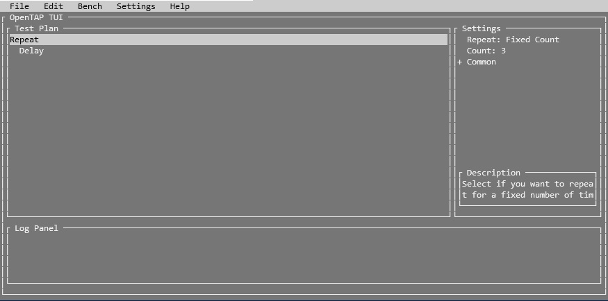

# OpenTAP TUI (Textual User Interface)
The OpenTAP TUI is a textual based user interface that can be used from a terminal. It gives you a graphical way to create OpenTAP test plans (`.TapPlan`) and install OpenTAP packages.

It supports running in almost every terminal including in Docker containers.

## Install
Either build it from source or install it from the OpenTAP package repository ([packages.opentap.io](https://packages.opentap.io)).

### Install from Repository
- Install: `tap package install TUI`
- Run: `tap tui`
- Run Package Manager: `tap tui-pm`
- Run Results Viewer: `tap tui-results`

### From source
- Build: `dotnet build`
- Run: `OpenTAP.TUI/bin/Debug/tap tui`
- Run Package Manager: `OpenTAP.TUI/bin/Debug/tap tui-pm`
- Run Results Viewer: `OpenTAP.TUI/bin/Debug/tap tui-results`

### Via Docker
- See https://hub.docker.com/r/opentapio/opentap/tags for available OpenTap Docker images, the following example uses `9.15-ubuntu18.04`.
- Run: `docker pull opentapio/opentap:9.18.3-bionic`
- Run: `docker run --name mytui -it opentapio/opentap:9.18.3-bionic`
- Run: `tap package install TUI`
- Run: `tap tui`

## Documentation
More documentation is available [here](https://stefanholst.github.io/opentap-tui/).

## Known Issues

### Running Linux builds in Windows terminals causes graphical glitches
E.g. when running in an SSH session, or a linux build on WSL.
Launching the TUI with mono instead of dotnet, seems to work: 

`mono OpenTAP.TUI/bin/Debug/tap.dll tui`

## Maintainers
* @StefanHolst - stefan.holst@keysight.com
* @frederikja163 - frederik.andreasen@keysight.com
* @rmadsen-ks - rolf_madsen@keysight.com
