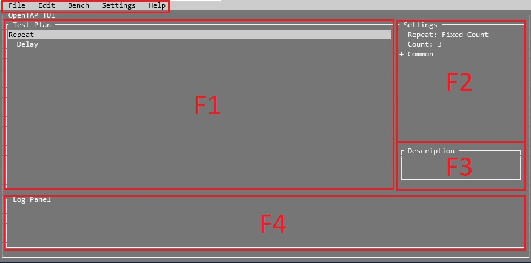

# Navigation
Navigate using arrows, 'TAB' and 'Enter'. Open the menu using 'F9'.

Move steps using space to select a step, then navigate to the place you want to drop the step and press space.
You can also use right arrow ('>') to insert a step into another step as a child step.

## Keyboard Shortcuts

|Keys|Shortcut|
|-|-|
|CTRL+t|Add new test step|
|CTRL+s|Save the current test plan|
|CTRL+SHIFT+s|Save the current test plan as a new file|
|CTRL+o|Open a test plan|
|CTRL+x|Quit the TUI|
|F1|Go to the test plan panel|
|F2|Go to the step settings panel|
|F3|Go to the test setting description panel|
|F4|Go to the log panel|
|F9|Go to menu|
|ALT[^1] + (f,e,b,s or h)|Open specific menu|
|TAB|Go to the next panel|
|ESC|Go back|

[^1]: On Linux (e.g., CentOS 7 with rh-dotnet21) it may be necessary to additionally hold SHIFT
      to make the ALT-prefixed shortcuts (b, e, f, h, s) work.

