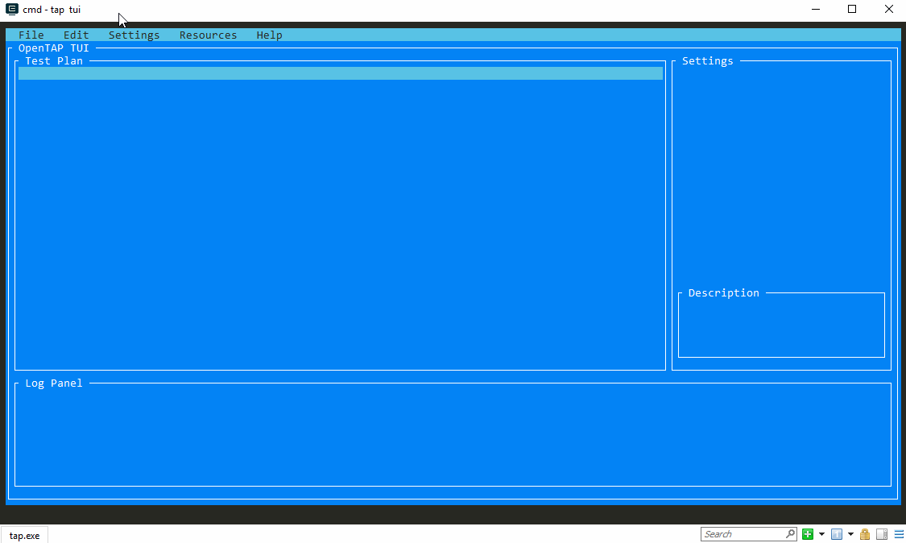

# OpenTAP TUI (Textual User Interface)
The OpenTAP TUI is a textual based user interface that can be used from a terminal. It gives you a graphical way to create OpenTAP test plans (`.TapPlan`).

It supports running in almost every terminal including in Docker containers.

